# WebPerformance

Readme link: https://web-performance-beta.vercel.app/README.md
Project link: https://web-performance-beta.vercel.app/01_StartWebsite/Football.html

# First measurements computer
## Lighthouse Tab
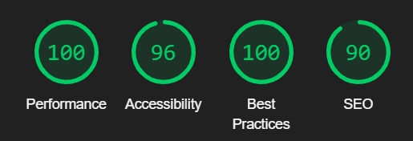

## Webpagetest.org
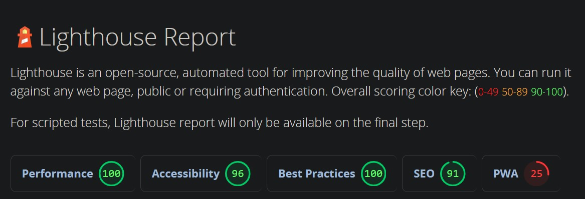
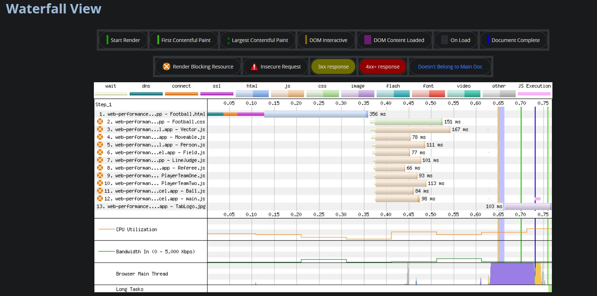

The idle time waiting for all scripts to load and process is what takes the longest and blocks the page rendering.

Acessibility:
- problems with the colour contrasts
- nested interactive control elements (a link inside a button)
- headings aren't in descending order (h2 is skipped)

Best Practices
- Browser error logged to the console, because the website uses an event type that has been removed

## Time to first byte
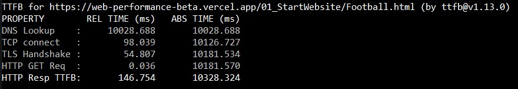
The DNS Lookup takes a long time with 10s, but the rest of the measurements are fast with 50-150ms.
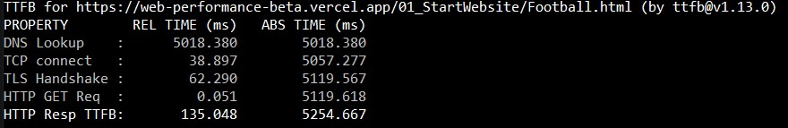
On the second measurement the DNS Lookup only takes half the time of the first measurement, but overall this time is still long and should be fixed.
The TCP connect takes only a third of the time compared to the first test. 
The TLS Handshake takes longer, but I would still count it as a fast time.
The HTTP response TTFB is rather high, indication problems in the servers response time.
I think most of the problems come from the way I deployed the Repository with it's subfolders in the domain on vercel, instead of directly deploying the actual website.

## Apache Bench
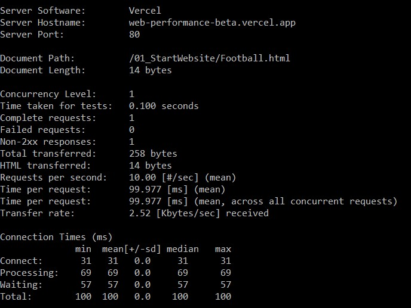
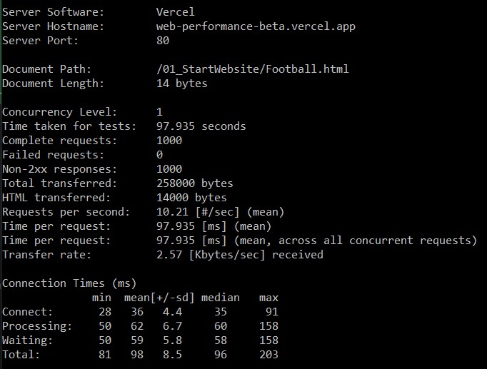
As the server responds with a non-success status code I don't think interpreting the results would make a lot of sense. But the times it takes seem rather short to me.

# First measurements mobile phone
As the website wasn't created to be used on phones and thus isn't responsive for them I think the results will look rather bad.

## Lighthouse and Webpagetest

The Lighthouse Test on the phone is still very good, but the Performance needs a bit of improvement.
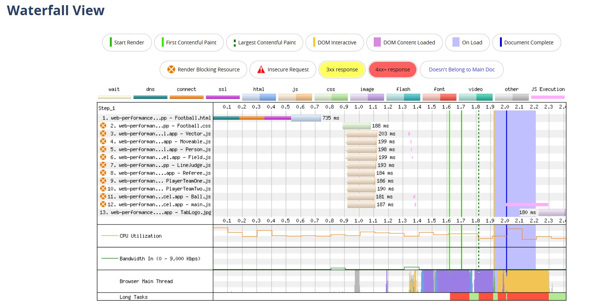
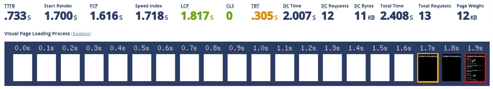
The loading time on the phone is a lot slower than on the computer, this also includes the FCP.

## Time to first Byte
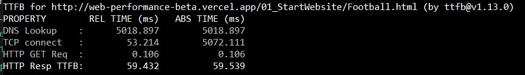
The DNS Lookup was about the same time as on the second computer measurement.
The TCP connect was slower than the second computer measurment, but still faster than the first. 
The HTTP Get Request was twice as long as on the computer.
The HTTP response TTFB on the other hand took only half the time compared to the computer, which really surprised me.

## Apache Bench
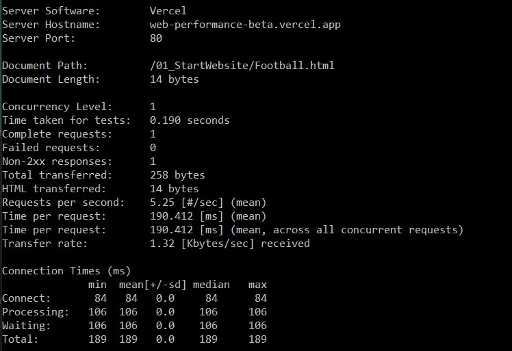
The AB Test has the same problem and takes twice as long on the phone compared to the computer.